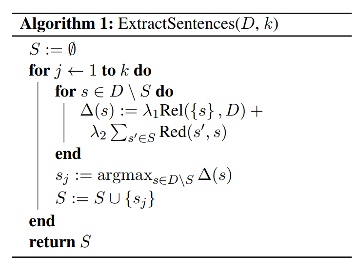
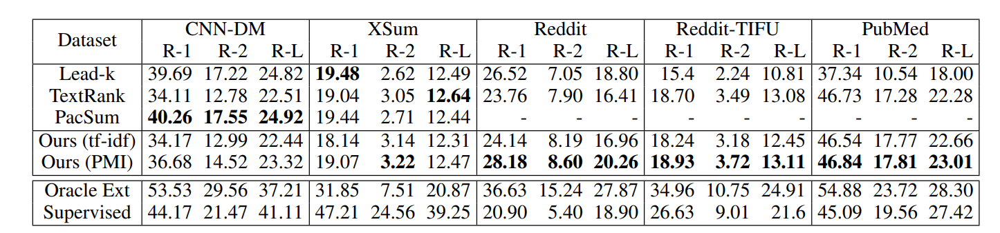

# Unsupervised Extractive Summarization using Pointwise Mutual Information

Vishakh Padmakumar, He He

New York University

Tags: Unsupervised Summarization, Extractive Summarization, Pointwise Mutual Information

Code: [vishakhpk/mi-unsup-summ: Repository for the code associated with the paper: Unsupervised Extractive Summarization using Mutual Information (github.com)](https://github.com/vishakhpk/mi-unsup-summ)

## Summary

This paper employs PMI to measure the similarity between sentences and document/summary for summary sentence selection. They develop a greedy sentence selection algorithm to maximize relevance and minimize redundancy of extracted sentences (MMR?).

## Method

A document with $n$ sentences $D={d_1, \dots, d_n}$.

A summary with $m$ sentences $S={s_1, \dots, s_m}$.

### Relevance 

$$
Rel(S,D)=\sum_{s\in S}\sum_{d\in D}pmi(s;d)
$$

### Redundancy

$$
Red(S)=\sum_{i=1}^m\sum_{j=i+1}^mpmi(s_i;s_j)
$$

### Target

$$
\max_{S\subseteq D}\lambda_1 Rel(S,D)+\lambda_2 Red(S)
$$

### PMI

The definition: $pmi(s;d)=\log \frac{p(s|d)}{p(d)} = \log \frac{p{d|s}}{p(s)}$

In this paper, they employ language model to estimate PMI:
$$
pmi(s;d) = \log \frac{p_{LM}(d|s)}{p_{LM}(d)} \\
pmi(s_i;s_j)=\log \frac{p_{LM}(s_j|s_i)}{p_{LM}(s_j)}, i <j  
$$
Extract algorithm:

## Results

## Comments

- PMI + MMR + Language Model 

